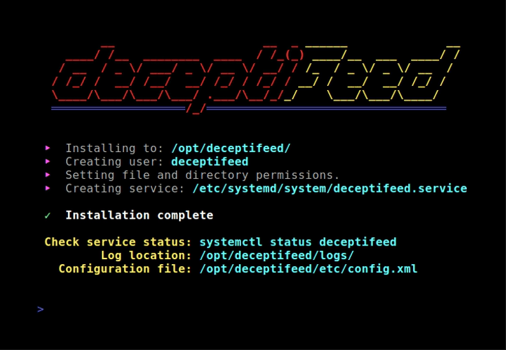

## Deceptifeed

`Deceptifeed` is a network defense tool that creates fake network services, or **honeypots**, to detect potential threats. It also provides a real-time **threat feed** that integrates with most enterprise firewalls. This feed lists the IP addresses that accessed your honeypots, allowing firewalls to automatically block them from reaching your legitimate services.

Unlike conventional honeypots that provide attackers with rich simulated environments, Deceptifeed is intentionally minimal. Simply the act of interacting with a fake service on your network is reason to trigger a defensive response. The integrated threat feed enables immediate action without needing a SIEM or additional tools.


## Installation

### Option 1: Download the binary

1. Download the latest binary from the [Releases page](https://github.com/r-smith/deceptifeed/releases).
2. Extract the downloaded file.
3. Run `install.sh` to install the application (optional).
   - Note: `install.sh` is intended for Linux distributions that use systemd (Ubuntu, Debian, Red Hat, Arch, SUSE, etc.).

```shell
# Extract.
tar xvzf <release>.tgz
cd deceptifeed

# Install (optional).
sudo ./install.sh
```



### Option 2: Build from source

**Go** version **1.22+** is required to build from source.

```shell
# Clone the repository.
git clone https://github.com/r-smith/deceptifeed.git
cd deceptifeed

# Compile and build the binary to `./out/deceptifeed`.
make

# The installation script is intended for Linux distributions that use systemd.
# For other systems, simply run the binary in `./out/` to launch Deceptifeed.
sudo make install
```

## Usage

### Option 1: Use the installation script

If you're on a supported system, run `install.sh` or `make install`, as described in the previous section.

- Deceptifeed runs as a background service. Use `sudo systemctl status deceptifeed` to check its status.
- To modify the configuration, edit `/opt/deceptifeed/etc/config.xml`, then restart the service with `sudo systemctl restart deceptifeed`.

```
/opt/deceptifeed/
├── bin/
│   └── deceptifeed
├── certs/
│   ├── https-cert.pem
│   ├── https-key.pem
│   └── ssh-key.pem
├── etc/
│   └── config.xml
└── logs/
    ├── honeypot.log
    └── threatfeed.csv
```

### Option 2: Run directly

You can run Deceptifeed directly without installation.

- Use `deceptifeed -help` to view the command-line options.
- By default, Deceptifeed starts the following network services:
  - SSH honeypot server on port 2022
  - HTTP honeypot server on port 8080
  - HTTPS honeypot server on port 8443
  - Threat feed server on port 8081
- Logs are saved to `deceptifeed-log.txt`.
- The threat feed database is saved to `deceptifeed-database.csv`.
- Certificates and keys are generated and saved as `deceptifeed-*.crt` and `deceptifeed-*.key`.

```shell
$ ./deceptifeed
Starting SSH server on port: 2022
Starting HTTP server on port: 8080
Starting HTTPS server on port: 8443
Starting Threat Feed server on port: 8081
```


## Features

- **Multiple Honeypot Servers:** Run any number of honeypot services simultaneously.
- **Threat Feed Server:** A real-time feed of IP addresses that have accessed your honeypots, delivered over HTTP for firewall integration.
- **Rich Structured Logging:** Capture detailed logs of everything in JSON format for easy parsing.
- **Secure:** The honeypot services never process or respond to client input; they only log the data received. Attackers are not given simulated or virtual environments.
- **Several Honeypot Types:**
  - **SSH Honeyot:** Record login attempts to a fake SSH service.
  - **HTTP/HTTPS Honeypot:** Record requested URLs and HTTP headers.
  - **Generic TCP/UDP Services:** Record data sent by connecting clients.
- **Cross-platform:** Supports Linux, macOS, Windows, and *BSD.


## Threat Feed

The threat feed provides a real-time list of IP addresses that have interacted with your honeypot services. It is delivered over HTTP for easy integration with firewalls. Most enterprise firewalls support ingesting custom threat feeds, allowing them to automatically block communication with the listed IP addresses.

Configure your firewall to use Deceptifeed as a custom threat feed and set your blocking rules accordingly. Ideally, exclude your honeypot services from any automatic blocking rules.

> [!NOTE]
> The threat feed is designed for private use and blocks access from non-private IP addresses.

**_Sample threat feed_**

```shell
$ curl http://threatfeed.example.com:8081
10.30.16.110
10.30.21.79
10.99.17.38
10.99.17.54
10.200.2.115
10.200.3.52
172.16.1.9
172.16.2.30
172.16.3.2
172.16.4.15
172.18.0.208
172.18.5.7
172.18.5.15
192.168.0.4
192.168.0.12
192.168.1.17
192.168.1.113
192.168.2.21
192.168.3.8
192.168.4.19
```


## Honeypots

### SSH

The SSH honeypot server responds to SSH authentication requests. Each attempt is automatically rejected, while the submitted credentials are logged. There is no actual shell for attackers to access.

**_Sample log from SSH honeypot_**

```json
{
  "time": "2024-10-23T23:08:29.423821763-07:00",
  "event_type": "ssh",
  "source_ip": "172.16.44.209",
  "source_port": "48212",
  "server_ip": "192.168.0.15",
  "server_port": "22",
  "server_name": "honeypot01",
  "event_details": {
    "username": "root",
    "password": "Password1",
    "ssh_client": "SSH-2.0-libssh2_1.10.0"
  }
}
```

### HTTP/HTTPS

The HTTP honeypot server responds to all HTTP requests. Requests to the *root* or `/index.html` return a customizable HTML page. Requests outside of that return a 404 error.

**_Sample log from HTTP honeypot_**

```json
{
  "time": "2024-10-23T23:01:38.989334656-07:00",
  "event_type": "http",
  "source_ip": "10.20.89.2",
  "source_port": "49926",
  "server_ip": "192.168.0.15",
  "server_port": "443",
  "server_name": "honeypot01",
  "event_details": {
    "method": "GET",
    "path": "/",
    "query": "",
    "user_agent": "Mozilla/5.0 (Windows NT 6.1; WOW64; Trident/7.0; AS; rv:11.0) like Gecko",
    "protocol": "HTTP/1.1",
    "host": "www.example.com",
    "request_headers": {
      "Accept-Encoding": "gzip, br",
      "X-Forwarded-For":"10.254.33.179",
    }
  }
}
```

### TCP

The TCP honeypot server lets you create customizable honeypot services that log data from connecting clients. You can define prompts that wait for and record input. For example, you can mimic a Telnet server by showing a welcome banner and then prompting for a username. When data is received, it's logged, and you can follow up with a password prompt. You can include any number of prompts to resemble FTP, SMTP, or other services. The client is disconnected after responding to all the prompts.

**_Sample log from TCP honeypot_**

```json
{
  "time": "2024-10-23T23:41:43.3235296-07:00",
  "event_type": "tcp",
  "source_ip": "172.18.206.66",
  "source_port": "5542",
  "server_ip": "192.168.0.15",
  "server_port": "25",
  "server_name": "honeypot01",
  "event_details": {
    "helo": "HELO example.com",
    "mail_from": "MAIL FROM:<spammer@example.com>",
    "rcpt_to": "RCPT TO:<recipient@example.com>",
    "line1": "Subject: Congratualtions! You've won!",
    "line2": "From: Customer Support <spammer@example.com>",
    "line3": "To: recipient@example.com",
  }
}
```

### UDP

The UDP honeypot server records incoming data on the listening port. It does not respond to clients.

Due to the connectionless nature of UDP and the possibility of spoofed source information, UDP honeypots do not integrate with the threat feed. Data is logged, but no further action is taken.

**_Sample log from UDP honeypot_**

```json
{
  "time": "2024-10-23T21:28:58.223738796-07:00",
  "event_type": "udp",
  "source_ip": "127.217.96.21 [unreliable]",
  "source_port": "5106 [unreliable]",
  "source_reliability": "unreliable",
  "server_ip": "192.168.0.15",
  "server_port": "5060",
  "server_name": "honeypot01",
  "event_details": {
    "data": "OPTIONS sip:nm SIP/2.0\r\nVia: SIP/2.0/UDP nm;branch=foo;rport\r\nMax-Forwards: 70\r\nTo: <sip:nm@nm>\r\nFrom: <sip:nm@nm>;tag=root\r\nCall-ID: 50000\r\nCSeq: 63104 OPTIONS\r\nContact: <sip:nm@nm>\r\nAccept: application/sdp\r\nContent-Length: 0\r\n\r\n"
  }
}
```


## Upgrading

To upgrade Deceptifeed, follow the same steps you used for installation:

#### If you installed from the binary:

1. Download the latest package from the [Releases page](https://github.com/r-smith/deceptifeed/releases).
2. If you originally installed using the installation script, extract the latest package and re-run `install.sh`.
3. If you did not use the installation script, simply replace the existing `deceptifeed` binary with the new version.

#### If you installed from source:

```shell
# Navigate to the directory where you cloned the `deceptifeed` repository:
cd #/path/to/deceptifeed/repository

# Update your local repository:
git pull origin main

# Compile the code:
make

# Install the updated version:
sudo make install
```


## Uninstalling

#### If you installed from the binary:

- If you used the installation script, re-run it with the `--uninstall` option.
```shell
sudo ./install.sh --uninstall
```

- If you did not use the installation script, simply delete the `deceptifeed` binary and any generated files. When running the binary directly, any generated files will be named `deceptifeed-*` in the same directory where you ran the `deceptifeed` binary.

#### If you installed from source:

```shell
# Navigate to the directory where you cloned the `deceptifeed` repository:
cd #/path/to/deceptifeed/repository

# Uninstall Deceptifeed:
sudo make uninstall
```
