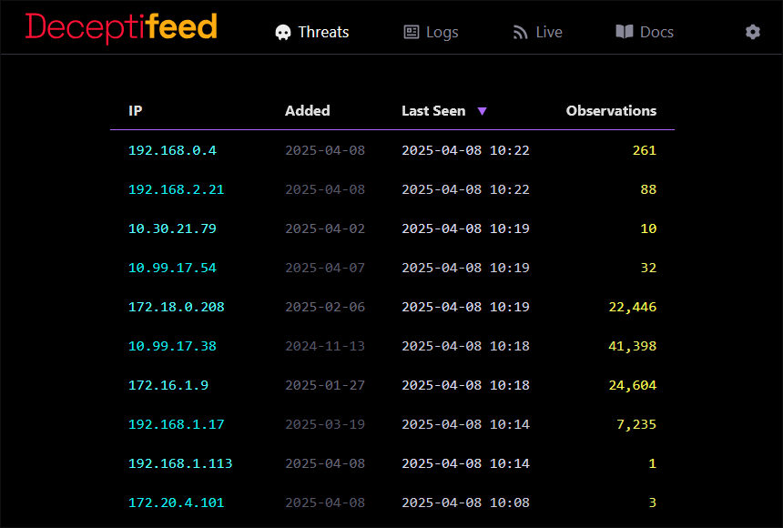

<p>
  <picture>
    <source media="(prefers-color-scheme: dark)" srcset="assets/logo-dark.svg">
    <source media="(prefers-color-scheme: light)" srcset="assets/logo-light.svg">
    
  </picture>
</p>

`Deceptifeed` is a honeypot and threat feed server. It runs multiple deceptive network services (honeypots), while the threat feed lists IP addresses that have interacted with the honeypots. Additionally, `Deceptifeed` provides real-time visibility into honeypot activity, allowing you to monitor logs and interactions as they occur.

When an IP address interacts with a fake server on your network, why should it be allowed to access your real servers? `Deceptifeed` helps you build an automated defense system to reduce such risks. In a typical deployment, it runs alongside your real servers. The honeypots are exposed to the internet, while the threat feed remains private for use with your internal tools.

Most enterprise firewalls support ingesting threat feeds. By pointing to `Deceptifeed`, your firewall can automatically block IP addresses that interact with the honeypots. For other security tools, the threat feed is available in several formats, including plain text, CSV, JSON, and TAXII.


## Visuals

*Deployment diagram*

<a href="assets/diagram-light.svg?raw=true">
<picture>
  <source media="(prefers-color-scheme: dark)" srcset="assets/diagram-dark.png" width="884">
  <source media="(prefers-color-scheme: light)" srcset="assets/diagram-light.png" width="884">
  
</picture>
</a>

<br>
<br>


<br>


## Quick Start

This section guides you through trying Deceptifeed as quickly as possible. There are no dependencies, configuration, or installation required. Refer to the [Installation section](#installation) when you're ready to set up a production environment.

### Option 1: Download the binary

1. Download the latest release from the [Releases page](https://github.com/r-smith/deceptifeed/releases).
2. Extract and run the `deceptifeed` binary.

```shell
# Extract:
tar xvzf <release>.tar.gz

# Change into the extracted directory:
cd deceptifeed

# Run:
./deceptifeed
```

A `default-config.xml` file is included with the release but is not used by default. Instead, Deceptifeed starts with sensible defaults, and you can customize options using command-line flags. Run `./deceptifeed --help` to view the available options. If you want to use a configuration file, rename `default-config.xml` to `config.xml`, and Deceptifeed will automatically use it. You'll need to update several paths in the configuration. Search for occurrences of `/opt/deceptifeed/` in the file and adjust the paths as needed.

### Option 2: Docker

```shell
# Pull and run the latest Deceptifeed Docker image:
docker run -d --name deceptifeed -p 2222:2222 -p 8080:8080 -p 9000:9000 deceptifeed/server:latest

# (Optional) Delete the container when you're finished testing:
docker rm -f deceptifeed
```

### Try it out

```shell
# Trigger login attempts on the SSH honeypot:
ssh -p 2222 root@<your-ip-address>

# Trigger requests to the HTTP honeypot:
curl -v http://<your-ip-address>:8080

# Retrieve the threat feed in JSON format:
curl http://<your-ip-address>:9000/json

# View the threat feed web interface:
# From a web browser, navigate to `http://<your-ip-address>:9000`
```

## Installation

### Option 1: Install on a Linux system

An installation script is available to quickly configure a production setup on a Linux system. The script supports only Linux distributions that use **systemd** (Debian, Ubuntu, Red Hat, Arch, SUSE, etc.).

1. Download the latest release from the [Releases page](https://github.com/r-smith/deceptifeed/releases).
2. Extract and run the `install.sh` script.

```shell
# Extract:
tar xvzf <release>.tar.gz

# Change into the extracted directory:
cd deceptifeed

# Install:
sudo ./install.sh
```


The installation script performs the following tasks:
- Creates a low-privilege `deceptifeed` user and group to run Deceptifeed.
- Sets up a directory structure under `/opt/deceptifeed/` to organize everything.
- Registers Deceptifeed as a background service and configures it to start automatically at boot.

Once installed:
- Run `systemctl status deceptifeed` to check the status of the background service.
- To modify the configuration, edit `/opt/deceptifeed/etc/config.xml`, then restart the service with `sudo systemctl restart deceptifeed`.

**_Directory structure_**

```
/opt/deceptifeed/
├── bin/
│   └── deceptifeed
├── certs/
│   ├── https-cert.pem
│   ├── https-key.pem
│   └── ssh-key.pem
├── etc/
│   └── config.xml
└── logs/
    ├── honeypot.log
    └── threatfeed.csv
```

### Option 2: Docker

1. Create a directory on your host system (for example, `/opt/deceptifeed/`) to store your configuration file and persistent data.
```shell
mkdir /opt/deceptifeed/
```
2. Download the default configuration file to the directory you created in step 1. The configuration file must be named `config.xml`.
```
curl https://raw.githubusercontent.com/r-smith/deceptifeed/main/configs/docker-config.xml -o /opt/deceptifeed/config.xml
```
3. Edit the configuration file to suit your needs. The default configuration file is production-ready.
4. Run the Deceptifeed Docker container.
```shell
docker run --detach --name deceptifeed \
--env "TZ=America/Los_Angeles" \
--publish 2222:2222 \
--publish 8080:8080 \
--publish 8443:8443 \
--publish 9000:9000 \
--restart unless-stopped \
--volume /opt/deceptifeed/:/data/ \
deceptifeed/server:latest
```

Here is a breakdown of the arguments:
- `--detach` instructs Docker to run the Deceptifeed container in the background.
- `--env "TZ=xxx/yyy"` sets the time zone. Replace `xxx/yyy` with the TZ identifier for your local time zone. If you prefer UTC time, don't include this argument. Refer to this [list of time zones](https://en.wikipedia.org/wiki/List_of_tz_database_time_zones) for valid TZ identifiers.
- `--publish ####:####` opens a network port on your host machine and maps it to Deceptifeed's Docker container. The first number specifies the port your host system listens on. You can set it to any open port. The second number specifies the port used by Deceptifeed inside the Docker container, which should match the ports configured in `config.xml`. There are multiple `--publish` arguments because Deceptifeed runs multiple network services. The default configuration includes an SSH honeypot on port 2222, an HTTP honeypot on port 8080, an HTTPS honeypot on port 8443, and the threat feed on port 9000. If you want your host machine to listen on port 443 for the HTTPS honeypot, for example, you would use the following line `--publish 443:8443 \`. This makes your host system listen on port 443 and maps it to the HTTPS honeypot defined for port 8443 in `config.xml`.
- `--restart unless-stopped` ensures Deceptifeed starts automatically when the host boots.
- `--volume /opt/deceptifeed/:/data/` specifies the directory on your host machine where persistent data is stored. If you used a different directory, adjust the path accordingly, but keep `:/data/` unchanged. For example: `--volume /path/to/deceptifeed/directory/:/data/ \`.
- `deceptifeed/server:latest` is the latest Docker image for Deceptifeed, hosted on *Docker Hub*. The image is updated with each official release and can be viewed on [Docker Hub](https://hub.docker.com/r/deceptifeed/server).


## Features

- **Honeypot Servers:**
  - Run any number of honeypot services simultaneously.
  - Honeypots are low interaction (no simulated environments for attackers to access).
  - **SSH honeyot:** Record and reject login attempts to a fake SSH service.
  - **HTTP/HTTPS honeypot:** Record requested URLs and HTTP headers.
  - **Generic TCP/UDP services:** Record data sent by connecting clients.
- **Threat Feed Server:**
  - A feed of IP addresses that have accessed your honeypots, delivered over HTTP.
  - Available in plain text, CSV, JSON, STIX, and TAXII.
  - Includes a friendly web interface for browsing feed and honeypot data.
- **Rich Structured Logging:**
  - Honeypot interactions are logged in a structured JSON format.
  - Logs can be optionally forwarded to the SIEM of your choice.
  - Automatic log file rollover ensures the system is self-managing.
- **Security:**
  - The honeypot services never process or respond to client input.
  - Attackers are not given simulated or virtual environments.
  - Deceptifeed is self-contained and does **not** use any external libraries, frameworks, plugins, third-party modules, or GitHub actions.
- **Cross-platform:**
  - Supports Linux, macOS, Windows, and *BSD.
  - Available as a Docker container.


## Threat Feed

The threat feed provides a list of IP addresses that have interacted with your honeypot services. It is delivered over HTTP for easy integration with firewalls. Most enterprise firewalls support ingesting custom threat feeds, allowing them to automatically block communication with the listed IP addresses.

Configure your firewall to use Deceptifeed as a custom threat feed and set your blocking rules accordingly. Ideally, exclude your honeypot services from any automatic blocking rules.

The threat feed is available in plain text, CSV, JSON, STIX, and TAXII.

**_Sample threat feed in plain text_**

```shell
$ curl http://threatfeed.example.com:9000/plain
```
```
10.30.16.110
10.30.21.79
10.99.17.38
10.99.17.54
172.16.1.9
172.16.2.30
172.16.3.2
172.18.0.208
172.18.5.7
172.18.5.15
192.168.0.4
192.168.1.17
192.168.1.113
192.168.2.21
192.168.3.8
```

**_Sample threat feed in JSON format_**

```shell
$ curl http://threatfeed.example.com:9000/json
```
```json
{
  "threat_feed": [
    {
      "ip": "10.32.16.110",
      "added": "2025-02-12T16:18:36-08:00",
      "last_seen": "2025-03-15T04:27:59-08:00",
      "observations": 27
    },
    {
      "ip": "192.168.2.21",
      "added": "2025-04-02T23:09:11-08:00",
      "last_seen": "2025-04-08T00:40:51-08:00",
      "observations": 51
    }
  ]
}
```


## Honeypots

### SSH

The SSH honeypot server responds to SSH authentication requests. Each attempt is automatically rejected, while the submitted credentials are logged. There is no actual shell for attackers to access.

**_Sample log from SSH honeypot_**

```json
{
  "time": "2024-10-23T23:08:29.423821763-07:00",
  "event_type": "ssh",
  "source_ip": "172.16.44.209",
  "server_ip": "192.168.0.15",
  "server_port": "22",
  "server_name": "honeypot01",
  "event_details": {
    "username": "root",
    "password": "Password1",
    "ssh_client": "SSH-2.0-libssh2_1.10.0"
  }
}
```

### HTTP/HTTPS

The HTTP honeypot server responds to all HTTP requests. Requests to the *root* or `/index.html` return a customizable HTML page. Requests outside of that return a 404 error.

**_Sample log from HTTP honeypot_**

```json
{
  "time": "2024-10-23T23:01:38.989334656-07:00",
  "event_type": "http",
  "source_ip": "10.20.89.2",
  "server_ip": "192.168.0.15",
  "server_port": "443",
  "server_name": "honeypot01",
  "event_details": {
    "method": "GET",
    "path": "/",
    "query": "",
    "user_agent": "Mozilla/5.0 (Windows NT 6.1; WOW64; Trident/7.0; AS; rv:11.0) like Gecko",
    "protocol": "HTTP/1.1",
    "host": "www.example.com",
    "headers": {
      "accept-encoding": "gzip, br",
      "x-forwarded-for":"10.254.33.179",
    }
  }
}
```

### TCP

The TCP honeypot server lets you create customizable honeypot services that log data from connecting clients. You can define prompts that wait for and record input. For example, you can mimic a Telnet server by showing a welcome banner and then prompting for a username. When data is received, it's logged, and you can follow up with a password prompt. You can include any number of prompts to resemble FTP, SMTP, or other services. The client is disconnected after responding to all the prompts.

**_Sample log from TCP honeypot_**

```json
{
  "time": "2024-10-23T23:41:43.3235296-07:00",
  "event_type": "tcp",
  "source_ip": "172.18.206.66",
  "server_ip": "192.168.0.15",
  "server_port": "25",
  "server_name": "honeypot01",
  "event_details": {
    "helo": "HELO example.com",
    "mail_from": "MAIL FROM:<spammer@example.com>",
    "rcpt_to": "RCPT TO:<recipient@example.com>",
    "line1": "Subject: Congratualtions! You've won!",
    "line2": "From: Customer Support <spammer@example.com>",
    "line3": "To: recipient@example.com",
  }
}
```

### UDP

The UDP honeypot server records incoming data on the listening port. It does not respond to clients.

Due to the connectionless nature of UDP and the possibility of spoofed source information, UDP honeypots do not integrate with the threat feed. Data is logged, but no further action is taken.

**_Sample log from UDP honeypot_**

```json
{
  "time": "2024-10-23T21:28:58.223738796-07:00",
  "event_type": "udp",
  "source_ip": "127.217.96.21 [unreliable]",
  "source_reliability": "unreliable",
  "server_ip": "192.168.0.15",
  "server_port": "5060",
  "server_name": "honeypot01",
  "event_details": {
    "data": "OPTIONS sip:nm SIP/2.0\r\nVia: SIP/2.0/UDP nm;branch=foo;rport\r\nMax-Forwards: 70\r\nTo: <sip:nm@nm>\r\nFrom: <sip:nm@nm>;tag=root\r\nCall-ID: 50000\r\nCSeq: 63104 OPTIONS\r\nContact: <sip:nm@nm>\r\nAccept: application/sdp\r\nContent-Length: 0\r\n\r\n"
  }
}
```


## Upgrading

### Binary

**If you originally installed using the installation script:**
1. Download the latest release from the [Releases page](https://github.com/r-smith/deceptifeed/releases).
2. Extract the files.
3. Run `install.sh`. The script will detect the existing installation and prompt you to upgrade.
   - Optionally, you can add `--yes` to automatically confirm the upgrade prompt.
```shell
# Extract:
tar xvzf <release>.tar.gz

# Change into the extracted directory:
cd deceptifeed

# Install (add `--yes` to auto-confirm the upgrade):
sudo ./install.sh
```

**If you did not use the installation script:**
1. Download the latest release from the [Releases page](https://github.com/r-smith/deceptifeed/releases).
2. Extract the files.
3. Replace the existing `deceptifeed` binary with the new version.

### Docker

1. Pull the latest version of the Deceptifeed image:
```shell
docker pull deceptifeed/server:latest
```
2. Stop and remove the existing container:
```shell
docker stop deceptifeed
docker rm deceptifeed
```
3. Recreate the container with the new image:
```shell
# The `docker run` command will vary depending on how you originally ran the container.
# If you used the example from this documentation, it will look like this:
docker run --detach --name deceptifeed \
--env "TZ=America/Los_Angeles" \
--publish 2222:2222 \
--publish 8080:8080 \
--publish 8443:8443 \
--publish 9000:9000 \
--restart unless-stopped \
--volume /opt/deceptifeed/:/data/ \
deceptifeed/server:latest
```


## Uninstalling

### Binary

**If you originally installed using the installation script:**
1. Re-run `install.sh` with the `--uninstall` option.
```shell
sudo ./install.sh --uninstall
```

**If you did not use the installation script:**
1. Delete the `deceptifeed` binary and any generated files.

### Docker

```shell
docker stop deceptifeed
docker rm deceptifeed
```
